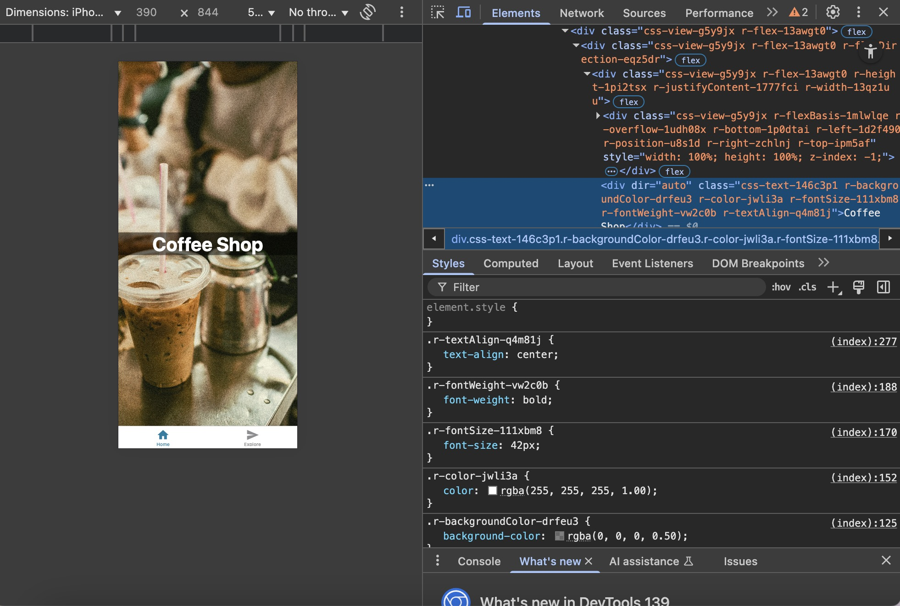

# 
React Native Full Course for Beginners
-----
Course: 
React Native Full Course for Beginners
Instructor: Dave Gray
Author: Sheila Anguiano

-----
# Table of Contents 
1. [Start Here](#start)
2. [Build and App](#build)
3. [Functions](#functions)
4. [Loops](#loops)
5. [Arrays](#arrays)

-------
## Start Here <a name="start"></a>
Knowing React is not required for this course, but is definitely helpful, but you'll need to know HTML, CSS and JavaScript are pre-requisites for this course.

What you need:
https://reactnative.dev/
https://code.visualstudio.com/
https://git-scm.com/
https://nodejs.org/en
https://expo.dev/


**Recommended Extensions**
- React Native Tools
- Expo Tools: Expo is a framework recommended in React Native as good starting point

Using the Expo documentation we'll create our first project 
`npx create-expo-app@latest`

After creating the App, in the Expo documentation you'll be asked where would you like to develop, in a Android Device or iOS device, you can pick your environment [here](https://docs.expo.dev/get-started/set-up-your-environment/?platform=ios&device=physical)

After downloading ExpoGo for your device, now we'll start the app using `npx expo start` 

## Build and App <a name="build"></a>

Now, we'll start building an app, we'll go to app > tabs > index.tsx and update the following:
```JavaScript
import React from 'react'
import { Text, View } from 'react-native'

const app = () => {
  return (
    <View>
      <Text>Coffee Shop</Text>
    </View>
  )
}

export default app

```
We'll apply some styles:
```JavaScript 
import React from 'react'
import { StyleSheet, Text, View } from 'react-native'

const app = () => {
  return (
    <View style={styles.container}>
      <Text style={styles.text}>Coffee Shop</Text>
    </View>
  )
}

export default app

const styles = StyleSheet.create({
  container: {
    flex: 1,
    flexDirection: 'column',
  },
  text: {
    color: 'white',
    fontSize: 42,
    fontWeight: 'bold',
    textAlign: 'center'
  }
})
```
We'll put images in the assets/images directory and update our styles:
```
import icedCoffeeImg from "@/assets/images/iced-coffee.jpg";
import { ImageBackground, StyleSheet, Text, View } from 'react-native';

const app = () => {
  return (
    <View style={styles.container}>
      <ImageBackground
        source={icedCoffeeImg}
        resizeMode="cover"
        style={styles.image}
      >
        <Text style={styles.text}>Coffee Shop</Text>
      </ImageBackground>
    </View>
  )
}

export default app

const styles = StyleSheet.create({
  container: {
    flex: 1,
    flexDirection: 'column',
  },
  image: {
    width: '100%',
    height: '100%',
    flex: 1,
    resizeMode: 'cover',
    justifyContent: 'center',

  },
  text: {
    color: 'white',
    fontSize: 42,
    fontWeight: 'bold',
    textAlign: 'center',
    backgroundColor: 'rgba(0,0,0,0.5)',
  }
})
```
Now our project looks like this:
